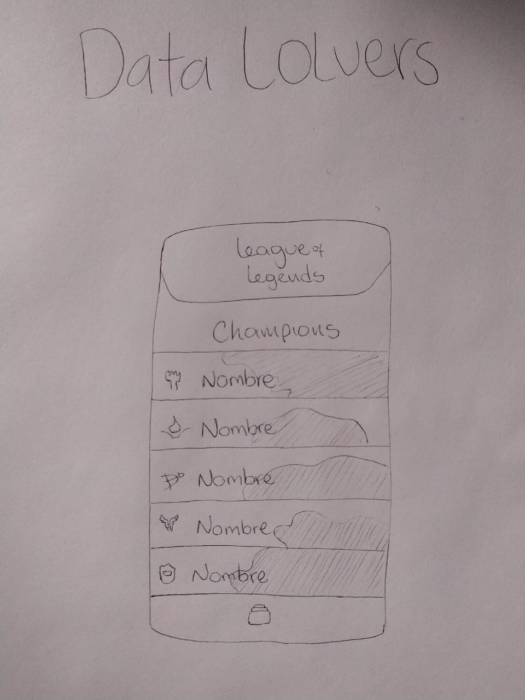
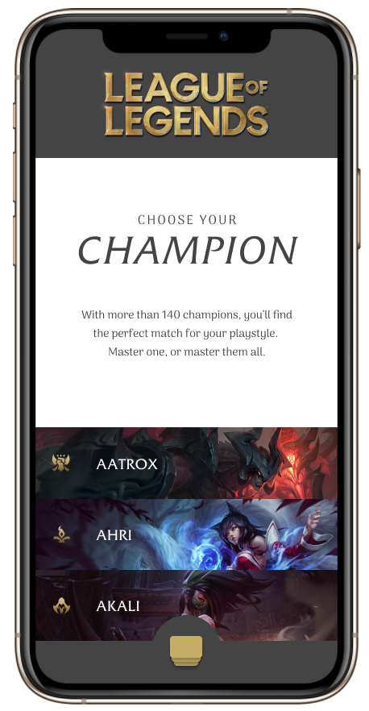
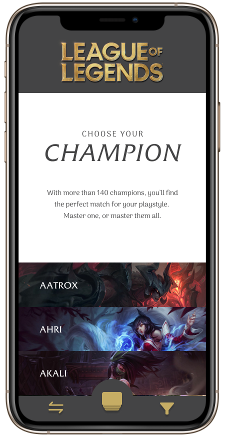
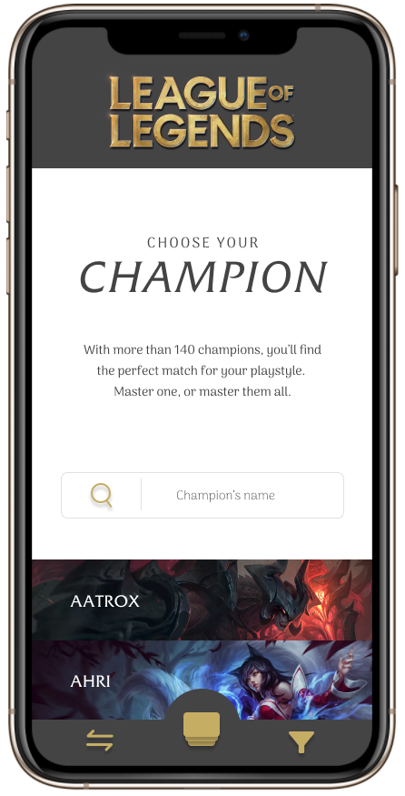
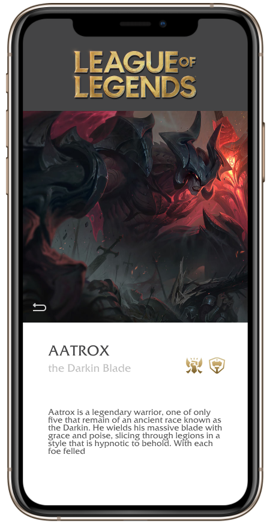

# Data LOLvers

## Index

* [1. Preamble](#1-preamble)
* [2. Product definition](#2-product-definition)
* [3. User stories](#3-user-stories)
* [4. Low fidelity prototype](#4-low-fidelity-prototype)
* [5. High fidelity prototype](#5-high-fidelity-prototype)
* [6. Boilerplate](#6-boilerplate)
* [7. Learning goals checklist](#7-learning-goals-checklist)

## 1. Preamble

As a second project, we decided to focus on League of Legends, we found this game as an opportunity to explore the game world, illustration and software development. Our project is going to be Responsive and it has four user histories based on our research. The principal meaning of Data Lovers is to organize, modify, and create selectors of the data.

## 2. Product definition

Our product is an organized and practice way to filter the data of League of Legends, we decided to make a friendly and intuitive interface, firstly with a knowledge in users needs. In second place, our design is oriented to minimalism and simple

## 3. User stories

### H1

_I, as a curious player, want to see all the champions available in the game to choose one to play._

- Acceptance criteria

  - Images of champions
  - Names of champions
  - Mobile interface
  - Links to have more info

- Definition of done

  - Sketch (Low fidelity)
  - Sketch's feedback (Laboratoria- External)
  - High fidelity prototype
  - Feedback Figma prototype
  - Fork and clone repository
  - HTML
  - CSS (Header and footer)
  - Show data (name and splash)
  - Upload repository in GitHub

### H2

_I, as an user, want to filter champions by role to organized my team._

- Acceptance criteria

  - Select a role with a click
  - See all champions that corresponds to my selection
  - Champion's name

- Definition of done

  - Update high fidelity prototype
  - Feedback Figma prototype
  - Function role
  - Call function with addEventListenner
  - Update repository

### H3

_I, as an user, want to search champions by name_

- Acceptance criteria

  - See champions that contains characters writed

- Definition of done

  - Update high fidelity prototype
  - Feedback Figma prototype
  - Function to search
  - Call function with addEventListenner
  - Unitary test
  - Update repository

### H4

_I, as an user, want to know a specific information about my champions_

- Acceptance criteria (name, title, blurb & splash)

  - See champions that contains characters writed

- Definition of done

  - Update high fidelity prototype
  - Feedback Figma prototype
  - Function to search
  - Call function with addEventListenner
  - Responsive (mobile first)
  - Unitary test
  - Update repository


## 4. Low fidelity prototype



## 5. High fidelity prototype

We used [Figma](https://www.figma.com/) to perform this requirement, this is [our project](https://www.figma.com/file/iEn9pMDOrXimisUXSeY8UF/League-Of-Legends-Data-Lovers-Mobile?node-id=0%3A1)

### Mobile version - First sprint



### Mobile version - Second sprint



### Mobile version - Third sprint



### Mobile version - Fourth sprint



## 6. Boilerplate

```Data Lovers
.
├── EXTRA.md
├── README.md
├── package.json
├── src
|  ├── data\lol
|  |  ├── lol
|  |  ├── lol.js
|  |  ├── lol.json
|  |  └── README.md
|  ├── fonts
|  |  └── Friz Quadrata Regular.ttf
|  ├── img
|  |  └── (Visual resources)
|  ├── data.js
|  ├── index.html
|  ├── main.js
|  ├── responsive.css
|  └── style.css
└── test
   └── data.spec.js

```

## 7. Learning goals checklist

### HTML y CSS

* [ x ] [Uso de HTML semántico.](https://developer.mozilla.org/en-US/docs/Glossary/Semantics#Semantics_in_HTML)
* [ x ] Uso de selectores de CSS.
* [ x ] Construir tu aplicación respetando el diseño realizado (maquetación).
* [ x ] [Uso de flexbox en CSS.](https://css-tricks.com/snippets/css/a-guide-to-flexbox/)

### DOM y Web APIs

* [ x ] Uso de selectores del DOM.
* [ x ] Manejo de eventos del DOM.
* [ x ] [Manipulación dinámica del DOM.](https://developer.mozilla.org/es/docs/Referencia_DOM_de_Gecko/Introducci%C3%B3n)
(appendChild |createElement | createTextNode| innerHTML | textContent | etc.)

### JavaScript

* [ ] Uso de condicionales (if-else | switch | operador ternario)
* [ X ] Uso de bucles (for | for..in | for..of | while)
* [ ] Uso de funciones (parámetros | argumentos | valor de retorno)
* [ x ] Manipular arrays (filter | map | sort | reduce)
* [ x ] Manipular objects (key | value)
* [ x ] Uso ES modules ([`import`](https://developer.mozilla.org/en-US/docs/Web/JavaScript/Reference/Statements/import)
| [`export`](https://developer.mozilla.org/en-US/docs/Web/JavaScript/Reference/Statements/export))
* [ ] Diferenciar entre expression y statements.
* [ ] Diferenciar entre tipos de datos atómicos y estructurados.

### Testing

* [ ] [Testeo unitario.](https://jestjs.io/docs/es-ES/getting-started)

### Estructura del código y guía de estilo

* [ x ] Organizar y dividir el código en módulos (Modularización)
* [ x ] Uso de identificadores descriptivos (Nomenclatura | Semántica)
* [ x ] Uso de linter (ESLINT)

### Git y GitHub

* [ x ] Uso de comandos de git (add | commit | pull | status | push)
* [ x ] Manejo de repositorios de GitHub (clone | fork | gh-pages)
* [ ] Colaboración en Github (branches | pull requests | |tags)

### UX

* [ x ] Diseñar la aplicación pensando y entendiendo al usuario.
* [ x ] Crear prototipos para obtener feedback e iterar.
* [ x ] Aplicar los principios de diseño visual (contraste, alineación, jerarquía)
* [ x ] Planear y ejecutar tests de usabilidad.
